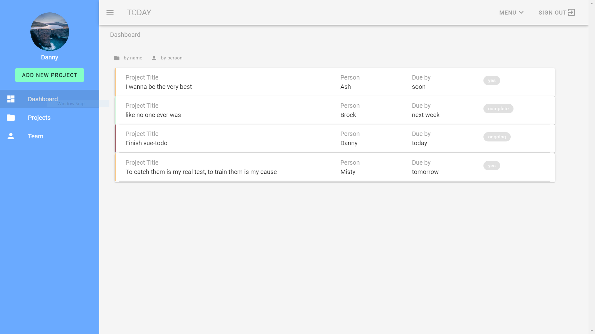
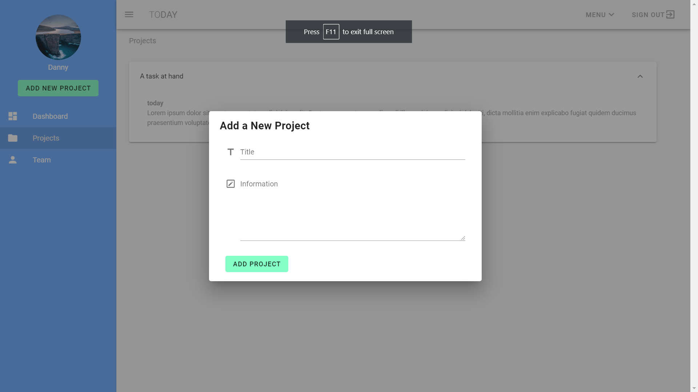
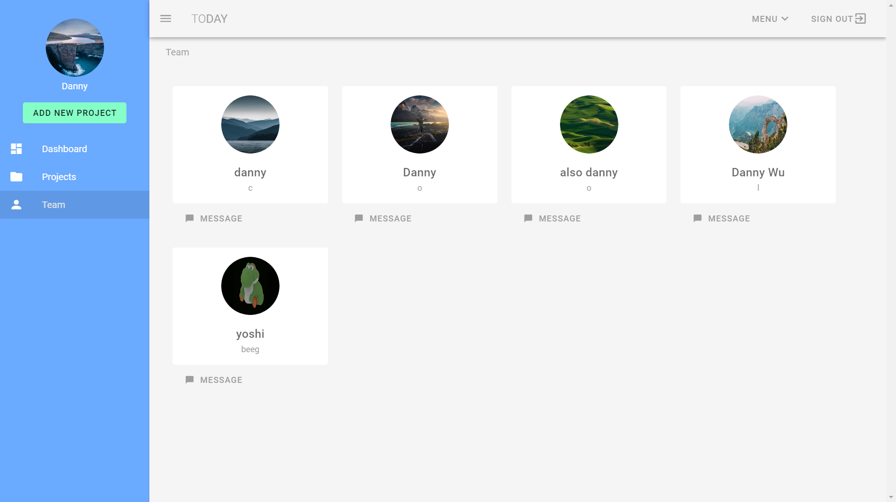

# vue-todo

- A to-do widget created using Vue.js and the Vuetify.js material design framework
- Used Firestore to save and add new tasks
- Created with the help of [The Net Ninja's Vuetify tutorial playlist](https://www.youtube.com/playlist?list=PL4cUxeGkcC9g0MQZfHwKcuB0Yswgb3gA5)







## Project setup
```
npm install
```

### Compiles and hot-reloads for development
```
npm run serve
```

### Compiles and minifies for production
```
npm run build
```

### Customize configuration
See [Configuration Reference](https://cli.vuejs.org/config/).
