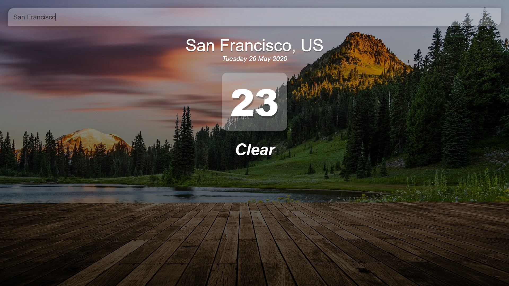
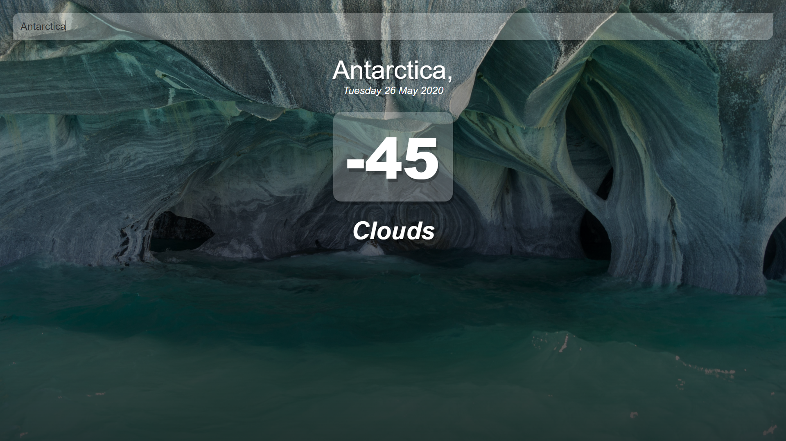

# vue-weather

- A weather widget created using Vue.js and the Openweathermap API (key not included!)
- Created with the help of [Tyler Potts' Vue Weather App Tutorial](https://www.youtube.com/watch?v=JLc-hWsPTUY)





## Project setup
```
npm install
```

### Compiles and hot-reloads for development
```
npm run serve
```

### Compiles and minifies for production
```
npm run build
```

### Lints and fixes files
```
npm run lint
```

### Customize configuration
See [Configuration Reference](https://cli.vuejs.org/config/).
